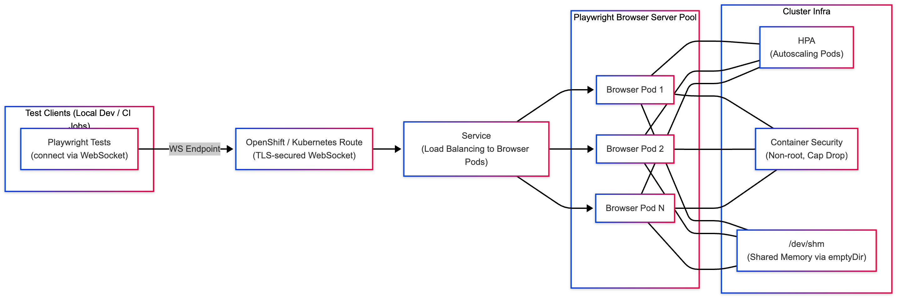

# Private Playwright Cloud on OpenShift

This guide shows how to run a private, scalable Playwright server on OpenShift and how to execute tests against it from laptops/CI or as cluster Jobs.

Reference: Playwright Remote Server and Docker guidance - https://playwright.dev/docs/docker

## Architecture diagram




## Prerequisites
- Access to an OpenShift project/namespace where you can create Deployments, Services, Routes, and HPAs
- OpenShift CLI (`oc`) installed
- Outbound internet egress from the namespace (for browsing external sites) or internal test targets available

Install `oc` (macOS without Homebrew):
```bash
ARCH=$(uname -m)
if [ "$ARCH" = "arm64" ] || [ "$ARCH" = "aarch64" ]; then OCURL="https://mirror.openshift.com/pub/openshift-v4/clients/ocp/stable/openshift-client-mac-arm64.tar.gz"; else OCURL="https://mirror.openshift.com/pub/openshift-v4/clients/ocp/stable/openshift-client-mac.tar.gz"; fi
mkdir -p ~/.local/bin /tmp/ocdl && cd /tmp/ocdl
curl -L -o oc.tgz "$OCURL" && tar -xzf oc.tgz
chmod +x oc kubectl && mv oc kubectl ~/.local/bin/
~/.local/bin/oc version --client
```

## What this deploys
- Playwright Server pool (Deployment) running `npx -y playwright@1.54.0 run-server --port 3000 --host 0.0.0.0`
- Service (port 3000) and a public Route (TLS edge) for WebSocket access
- HPA autoscaling by CPU
- Secure defaults: non-root, no privilege escalation, drop all caps, `/dev/shm` sized via `emptyDir` (no `--ipc=host`)

Files:
- `openshift/pw-server-deployment.yaml`
- `openshift/pw-server-service.yaml`
- `openshift/pw-server-route.yaml`
- `openshift/pw-server-hpa.yaml`
- `openshift/kustomization.yaml`
- Optional example runner: `openshift/pw-job-template.yaml`

## Deploy
```bash
# Log in to OpenShift
oc login --token=... --server=https://api.<cluster>:6443

# Select your project (replace with yours)
oc project <your-project>

# Apply manifests
oc apply -k openshift/

# Wait for rollout
oc rollout status deploy/pw-server --timeout=180s

# Get the Route host
oc get route pw-server -o jsonpath='{.spec.host}{"\n"}'
```

## Use from your laptop or CI (remote connection)
Keep your client Playwright version in lockstep with the server image version (here: 1.54.0).

Example using the included tests in this folder:
```bash
cd playwright-cloud
npm i
PW_TEST_CONNECT_WS_ENDPOINT=wss://<route-host>/ npx playwright test
```

In code:
```ts
import playwright from 'playwright';
const browser = await playwright.chromium.connect('wss://<route-host>/');
```

Notes:
- Use `wss://` for TLS (Route default). If you expose a plain HTTP Route, use `ws://` instead.
- Artifacts (traces/videos/screenshots) are generated on the client that runs the tests (not on the server pods).

## Optional: run tests inside the cluster (Job)
Use the example Job as a starting point: `openshift/pw-job-template.yaml`.
- It clones your tests repo, installs dependencies, sets `PW_TEST_CONNECT_WS_ENDPOINT` to the Route, and runs `npx playwright test`.

Edit the following environment variables in the template:
- `TEST_REPO`: Git URL of your test suite
- `TEST_DIR`: Optional subdirectory containing the tests
- `PW_WS_ENDPOINT`: Set to `wss://<route-host>/`

Apply and watch:
```bash
oc apply -f openshift/pw-job-template.yaml
oc logs -f job/pw-job-example
```

To persist artifacts, add an object storage uploader in the Job (e.g., to S3) and mount a PVC if needed.

## Configuration knobs
- Replicas: `spec.replicas` in `pw-server-deployment.yaml`
- Autoscaling: `pw-server-hpa.yaml` (min/max replicas, CPU target)
- Resources and `/dev/shm` size: container resources and the `emptyDir` volume size
- Route TLS: change to `reencrypt`/`passthrough` if required by your ingress policy
- Version pinning: update the image tag and the `playwright@<version>` in the Deployment args; match client version

## Security posture
- `runAsNonRoot: true`, `allowPrivilegeEscalation: false`, drop all Linux capabilities
- No host-level IPC; Chromium stability via larger `/dev/shm` (`emptyDir: { medium: Memory }`)
- Add NetworkPolicies/egress rules to restrict outbound access as needed

## Troubleshooting
- CrashLoopBackOff with npm EACCES
  - The Deployment sets `HOME=/tmp` and redirects npm cache to `/tmp/.npm` to avoid root-owned cache issues.
- Route works but clients fail to connect
  - Ensure your client uses `wss://<route-host>/` and is not behind a proxy blocking WebSockets
  - Test with `wscat` or `curl -I` to confirm upgrade headers
- Tests flake due to public targets (CAPTCHAs, rate limits)
  - Prefer deterministic targets (e.g., `wikipedia.org`) for smoke checks
- Version mismatch
  - Client Playwright must match the server’s; otherwise browsers may not be found

## Validate
```bash
# Run the included stable smoke test
PW_TEST_CONNECT_WS_ENDPOINT=wss://<route-host>/ npx playwright test tests/wikipedia.spec.ts
```

## Cleanup
```bash
oc delete -k openshift/
```

## FAQ
- Can I run multiple tenants?
  - Yes. Use separate projects/namespaces per team or deploy multiple server pools with distinct Routes.
- Can I add auth to the Route?
  - Use an OAuth proxy sidecar or terminate behind your API gateway; then route to the Service internally.
- Do I need `--ipc=host`?
  - No. We avoid privileged flags by sizing `/dev/shm` with an in-memory `emptyDir`. 
